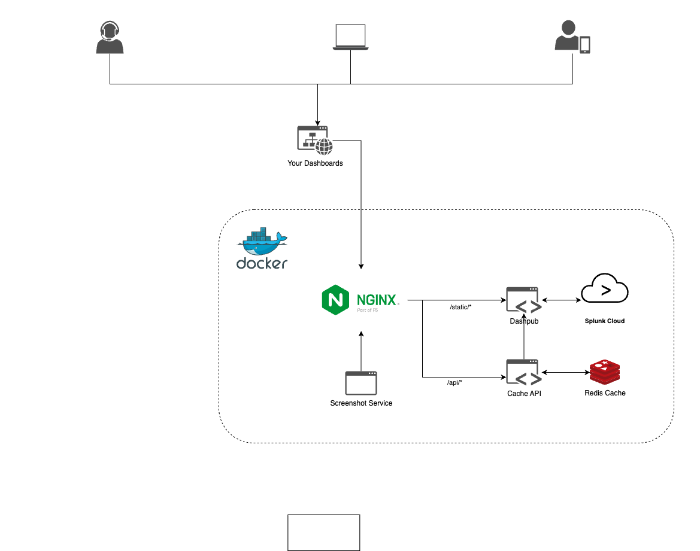
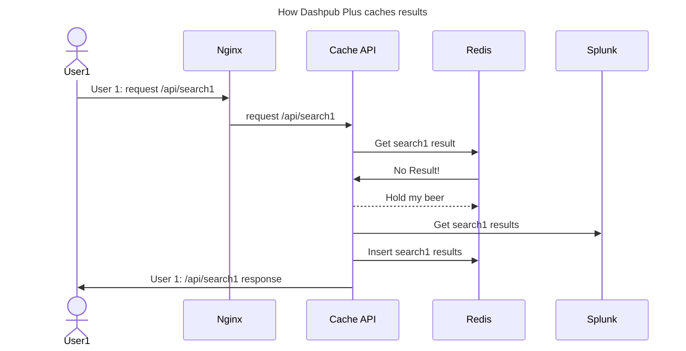
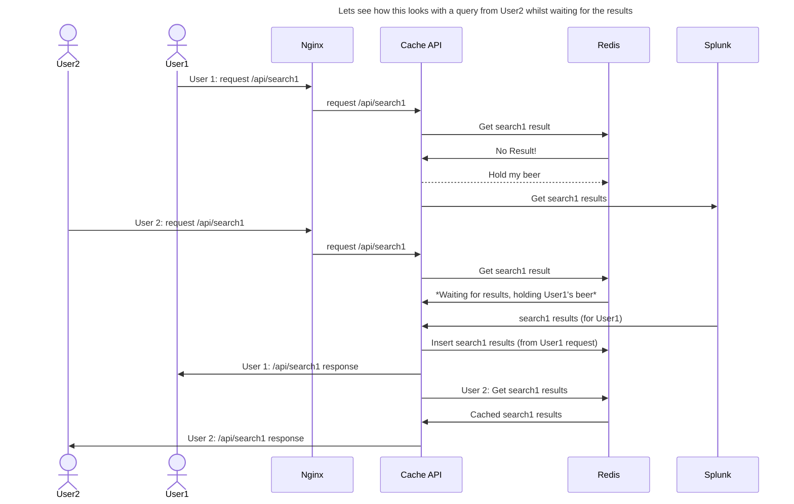
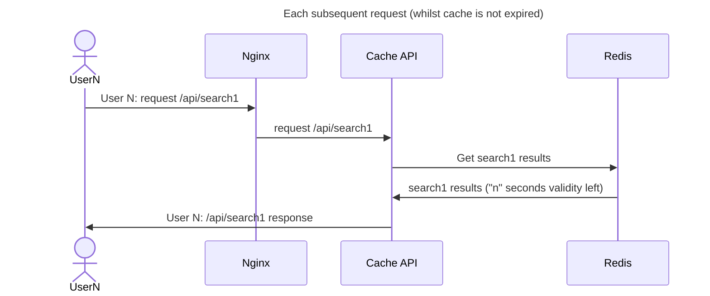

# Dashpub Plus Documentation

## Introduction

Dashpub Plus aims to enhance the existing Dashpub project by providing better segregation between Splunk and the end-users, allowing for higher scaling capabilities and improved performance. The primary driver behind this is to improve security by separating from Splunk and by reducing running costs, utilizing a Redis Cache for search results to ensure that multiple searches are not run against Splunk unnecessarily. This ensures that if multiple users visit a dashboard simultaneously, the number of searches run against Splunk is minimized - and even better, they'll get their results rendered faster!

## Components

Dashpub Plus "out of the box" consists of the following components:

- **Dashpub**: The main web application serving dashboards.
- **Cache API**: A RESTful API to interact with Redis and Dashpub.
- **Nginx**: Used to distribute traffic between Dashpub (for static content) and the Cache API for `/api` traffic which consists of search results.
- **Redis**: A single node or Redis cluster with 3 nodes for caching search results.
- **Splunk Enterprise**: Standalone Splunk instance, including one example dashboard for demonstration purposes.

## Architecture

### Overview

The architecture of Dashpub Plus is designed to optimize performance and security by using a caching layer and segregating different types of traffic. Here’s a high-level overview of how the components interact:

1. **Nginx**: Acts as the reverse proxy and load balancer.

   - Routes static content requests to Dashpub.
   - Routes API requests to the Cache API.

2. **Dashpub**: Serves the static content (dashboards) to the end-users and performs searches on behalf of the Cache API.

3. **Cache API**: Interacts with the Redis cache to fetch or store search results.

   - When a search request is made, the Cache API checks Redis for cached results.
   - If results are not cached, the Cache API queries Splunk, caches the results, and returns them to the requester.
   - If two people simultaenous request a result, the second request will wait for the results from the first requestor rather than also searching.

4. **Redis Cache**: Stores cached search results to reduce load on Splunk and provide better segregation.

5. **Splunk Enterprise**: Data source for your results.

### High Level Design



## Installation

### Prerequisites

- Docker and Docker Compose installed on the host machine. (Tested on Linux & Mac Silicon)

### Steps; easy as 1,2,3

1. **Clone the Repository**

   ```bash
   git clone https://github.com/livehybrid/dashpub-plus.git
   cd dashpub-plus
   ```

2. **Customise**
   Whilst the demo environment will work out the box, you may wish to modify `docker-compose-main.yml` to connect to an external Splunk instance and pull in your own dashboards. For more information on Dashpub's environment variables please see [Dashpub's Docker Docs](https://github.com/livehybrid/dashpub/blob/master/docker/README.md).

3. **Start the Services**
   Simply run setup.sh - this process will configure an authentication token for Splunk and then start the rest of the services, providing you a link to your dashboard(s).
   The setup script will print the port that nginx is listening on which is typically randomly assigned by Docker. A specific port can be specified by modifiying the docker compose file (such as 8000), change:
   ```yml
   ports:
     - 3001
   ```
   to:
   ```yml
   ports:
     - 8000:3001
   ```

## How Caching works

Redis caches data based on the "refresh" value for a specific search, this is defined in the [Dashpub template code](https://github.com/livehybrid/dashpub/blob/master/template/src/pages/api/data/%5Bdsid%5D.js#L51) which uses the search's options.redresh value, or 60 seconds, whichever is larger.

### Example 1 - Single user makes request



The search results returned to Redis have a TTL depending on the "refresh" value for the specific search.

### Example 2 - Lets see how this looks with a query from User2 whilst waiting for the results



### Example 3 - Each subsequent request (whilst cache is not expired)



Once the results expire the Redis entry is automatically removed and subsequent requests will require the results to be retrieved from Splunk (as per Example 1), this is achieved by using the TTL capability within Redis.

## Docker Compose Files

1. docker-compose-build.yml  
   Specific override to locally build the Cache API, Nginx and Screenshotter - this does not build a local image for the base dashpub image, for please checkout the dashpub repo and build the dashpub image from there. In the future this may be incorporate into dashpub-plus repo.

1. docker-compose-main.yml  
   This main docker-compose file contains the definition for a basic dashpub-plus implementation, containing a 3-node Redis cluster, Cache API, Nginx, Dashpub and screenshotter service, demonstrating the variables and configuration to get up and running. By default this is configured to use an external Splunk instance, however a local Splunk instance can be deployed with docker-compose-splunk.yml

1. docker-compose-simple.yml  
   This is a simplified version of the "main" compose file, this contains only required configuration and variables, with only a single Redis node, Cache API, Dashpub and Nginx (No screenshotter/Clustered Redis).
1. docker-compose-splunk.yml  
   Add a local Splunk instance into a simple/main deployment - This loads in a sample dashboard (./splunk/dashboards/example.xml)

## Docker Compose Variables

Here is a table of the necessary environment variables used to connect various components of dashpub-plus:

| Variable        | Description                     |
| --------------- | ------------------------------- |
| `REDIS_HOST`    | Hostname of the Redis server    |
| `REDIS_PASS`    | Password for Redis              |
| `REDIS_USER`    | Username for Redis              |
| `SPLUNKD_HOST`  | Hostname of the Splunk server   |
| `SPLUNKD_PORT`  | Port for Splunk server          |
| `SPLUNKD_USER`  | Username for Splunk             |
| `SPLUNKD_TOKEN` | Authentication token for Splunk |

## Setup and Configuration

The process is designed to be as easy as possible. The minimum requirements are to have Docker on Linux. The user can then run the `setup-splunk.sh` script, which will create a Splunk container, generate an authentication token once it has finished booting, and provide dashboards for the example use case/demo. The necessary minimum environment variables have already been set for Redis, Splunk, and Dashpub.

## Monitoring and Logging

The code is not currently instrumented for monitoring. However, using Docker, it is possible to specify logging output to Splunk HEC depending on the user's requirements. Here is an example of the config which could be applied to the nginx container to send logs to Splunk:

```yaml
logging:
  driver: splunk
  options:
    splunk-format: raw
    splunk-index: nginx_web
    splunk-source: docker:dashpub:nginx
    splunk-sourcetype: nginx:plus:access
    splunk-token: <YourHECToken>
    splunk-url: <YourSplunkHECEndpoint>
    splunk-verify-connection: false
```

For more information see the [Docker logging driver docs](https://docs.docker.com/config/containers/logging/splunk/)

## Advanced Configuration options

This repo currently contains a simple and a "standard" deployment of dashpub-plus through the relevant docker-compose files which are a good starting point for a new deployment.
The setup.sh file contains a number of switches based on environment variables to control the default setup, the following environment variables control the behaviour of the script:

| Variable Name | Purpose                                                                                                                                                                                                  |
| ------------- | -------------------------------------------------------------------------------------------------------------------------------------------------------------------------------------------------------- |
| BUILD_IMAGES  | When "true" will include docker-compose-build.yml and thus build certain docker images locally to be used rather than images from public repositories. (Defaults to false)                               |
| DASHPUB_ARCH  | The dashpub-plus architecture to deploy, which can currently be either "simple" or "main". (Defaults to "main")                                                                                          |
| SPLUNKD_URL   | Connection URL to Splunk's REST API (typically port 8089), in the format protocol://address:port, if the default is used then it will deploy a docker Splunk instance(Defaults to "https://splunk:8089") |

Users who are more familiar with docker-compose, or use other Docker orchestration tooling may prefer to interact with the docker-compose files directly rather than using `setup.sh`.

## Advanced Architectures

The possibilities are endless!
There are certainly a number of variations to the out-of-the-box setup of Dashpub Plus, Please reach out via the [GitHub issues page](https://github.com/livehybrid/dashpub-plus/issues) for any questions around custom/advanced architectures.
Examples:

- Move from local Redis instance to hosted Redis service, such as AWS Elasticache
- Front with Role Based Access Control (RBAC) setup, such as SAML authentication on an AWS Application Load Balancer, this forces users to login with SAML before the load balancer will direct them to the dashboards.
- High Availability - This is slightly more involved as during the build process the React app within Dashpub generates files with random file names for static content (such as JS and CSS) - this means that two separately generated Dashpub instances will not work well together behind a load balancer. Instead an initialised Dashpub docker container would need to be exported/saved before deploying to multiple nodes behind a load balancer. This additional step could be automated to reduce overhead and would then be able to provide high availability.

## Scaling and Performance

To handle increased load, users could place Redis clusters across multiple servers. Depending on the situation, it may be more appropriate to extend this architecture further, such as fronting the service with AWS CloudFront and then using Elasticache Redis for the cache. Docker containers could be scaled horizontally for high availability and improved fault tolerance.

## Troubleshooting

### Possible Issues

- **Connectivity Problems**: Check network configurations and ensure all docker services are running (`docker ps -a`).
- ** No Search results on Dashboards**: Verify the Splunk credentials and tokens. If using demo configuration then ensure that setup.sh reported successfully retrieving the token from Splunk.

### Steps to Troubleshoot

1. **Review Logs**: Check logs for each docker service / component to identify any errors or issues, feel free to raise an issue in GitHub providing as much detail as possible.
2. **Check Environment Variables**: Ensure all required environment variables are correctly set.
3. **Raise an Issue**: If the problem persists, raise an issue on the [GitHub repository](https://github.com/livehybrid/dashpub-plus/issues).

## Contributing

We welcome contributions! Please see the [CONTRIBUTING.md](https://github.com/livehybrid/dashpub-plus/blob/main/CONTRIBUTING.md) file for more details.

## Contact

For further questions or support, please open an issue on the [GitHub repository](https://github.com/livehybrid/dashpub-plus/issues).
